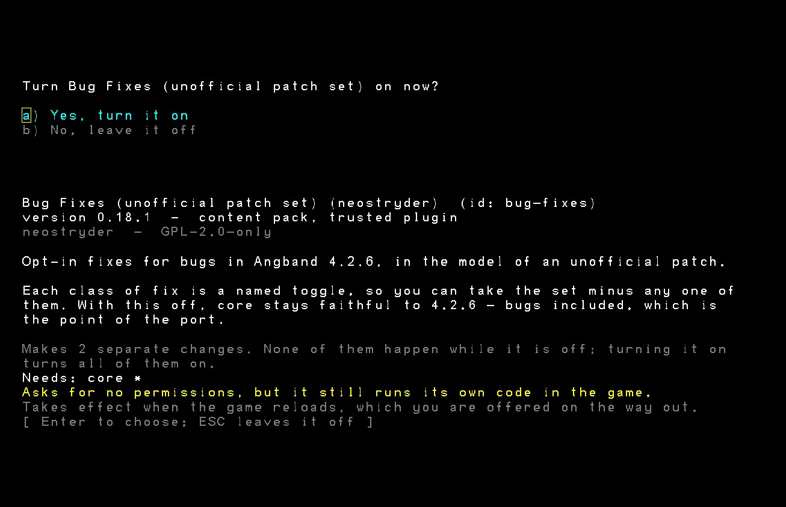

# bug-fixes: an unofficial patch set

Fixes for bugs in upstream Angband, for
[Neo Angband](https://github.com/neostryder/neo-angband), as a mod.

**This is a mod.** It is off until you enable it, every fix inside it is a named switch
you can turn off on its own, and disabling the mod leaves the game bug-for-bug as
Angband 4.2.6 is.



## Why this is a mod and not a better port

Neo Angband is an exact-parity port: bugs inherited from the reference code are
out of scope for the port itself and belong in this mod instead, while core
retains every wart of the reference code on purpose. A port that quietly fixed
things would stop being a port, and worse, you could never tell which of its
behaviours were Angband's and which were someone's opinion.

So the engine reproduces each of these faults, on purpose, and the engine's own test
suite has CONTROL tests pinning them: move one of these fixes back into core and the
suite fails and says why.

Every fix here is also *absent* rather than switched off when you turn it off. There is
no `bugfix.*` string anywhere in the engine. A flag-gated fix compiled into core would
still be core shipping the fix; this ships nothing.

## What it fixes

One player-facing toggle per **class** of fix, not one per atomic fix. A player
can reason about each class without reading engine code.

| Toggle | What it covers | What it does |
|---|---|---|
| **Text and history** (`bugfix.textAndHistory`) | Weapon lore text; [#4245](https://github.com/angband/angband/issues/4245); misc. strings; lore text | What the game writes down or says, with no game state changes. Corrects four item descriptions still written for a two-handed-weapon rule Angband 4.2 dropped (the Two-Handed Great Flail, the Pike, the Trident "of Wrath" and "Mundwine" - text only, no damage, weight, or slot changes). Drops a duplicate "Killed X" history entry when a unique is reached again through a shape-change or projection death path. Corrects upstream's own cosmetic message warts at the host's single message sink (exact-match table on purpose: messages arrive already interpolated, so a general rewrite would edit inscriptions and names you typed). Renames the Priest spell Light of Manwë to Light of Varda and says the blessed property is blessed by the Valar. |
| **State integrity** (`bugfix.stateIntegrity`) | [#4605](https://github.com/angband/angband/issues/4605), [#4664](https://github.com/angband/angband/issues/4664), [#4510](https://github.com/angband/angband/issues/4510) | The game's own bookkeeping staying consistent with itself, including across a save and reload. Writes the noise and scent heatmaps to the save so monsters track you identically after a reload. Adds a deterministic geometric tiebreak to the floor object list (nearer-to-top first, then leftmost) because upstream's `compare_items` is not a strict weak order. Refuses to commit an object that already carries a created artifact a second time. |
| **Level generation** (`bugfix.levelGeneration`) | reachable staircases | Anything that changes the layout a player walks around in, kept separate so a player who wants faithful layout is not forced to also give up the text and bookkeeping fixes. `alloc_stairs` does not exclude vault interiors and `ensure_connectedness` runs with `allow_vault_disconnect` at five of its six sites, so a vault the tunneller never joined can swallow a staircase. **Measured by the engine over 15,000 levels: 22 stranded, 0.15%**, overwhelmingly the up stair, because a level gets 3-4 down stairs against only 1-2 up, so one bad roll strands the floor. Confirmed here at engine 0.24.0 on a fresh sweep of 520 levels across depths 5 to 90: 4 stranded, all four the up stair. This section used to cite 10.2%; that figure was real but its non-vault majority was a defect in the port's own streamer code rather than inherited behaviour, and it has since been fixed in the engine. So this is a rare wart, not a common one. Places one reachable replacement, as close to the stranded original as the rules allow. |

All three default to on **once the mod is enabled**, which is not the same as on.
The weapon lore text corrections are filed under **Text and history** rather than
a toggle of their own: whether the game's text is being corrected is the only
question that toggle needs to answer, whatever the underlying mechanism - a
runtime message patch and a gamedata content patch are the same class of fix at
the player-facing level.

### The staircase fix draws no randomness, and that is load-bearing

It runs on every generated level, so if it took a single RNG draw every seed would stop
reproducing its dungeon. It takes none. A level that already satisfies the invariant
(the overwhelming majority) is bit-identical to one generated with no mod at all, and
only the stranded minority is touched, by one grid. This repository's stairs tests
ratchet that against real generated levels rather than trusting it.

## Installing

Two files: `manifest.json` and `plugin.js`. Any of:

- **In the game** - Mods -> **Install a mod...**, which fetches this repository at a
  release tag, never a branch, so what arrives cannot change under you afterwards. The
  install records a SHA-256 of every byte that arrived, which is what lets the manager
  answer later whether the copy on your machine has changed. It cannot tell you whether
  what arrived is what was published here, there being nothing to compare a first
  download against. This is the path that works in every browser, including the ones
  with no directory picker.
- **A folder** - clone this repository into your mods directory, or point the browser
  build at it with **Load mod folder**.

`plugin.js` is generated from `plugin.ts`, `stairs.ts` and `strings.ts` in this
repository, bundled into one module. It is committed because
that is what an install fetches. Edit the source, not this file, and if you are
reading it to decide whether to trust it, that is exactly why it ships unminified.

## Working on it

The source lives here now, and so do the tests. They boot a **real game** against the
published engine (`@rpgm-tools/neo-angband-core`) rather than a fake, because a
staircase-reachability fix proven against a hand-built cave is a fix proven against a
fixture: the staircase tests generate real levels at real depths.

```bash
npm install
```

```bash
npm run verify
```

That typechecks, runs the tests, and confirms the committed `plugin.js` is a current
build of the source, and the last one matters more than it looks. An install fetches the
committed `plugin.js` from a pinned tag and runs it as it is; nothing rebuilds it on the
way in. So a stale artefact passes every other check and is the file players actually
run, and `npm run check` is the only thing that looks.

No checkout of the game is needed. The engine, the content pack (Angband 4.2.6
gamedata, which the tests generate levels from) and the plugin builder are all
published packages, so `npm ci` is the whole setup and the suite proves this mod
against exactly what a third-party author would install. A sibling checkout of
[neo-angband](https://github.com/neostryder/neo-angband), or `NEO_ANGBAND_REPO`
pointing at one, is an override for developing against an engine change that has not
reached the registry yet.

```bash
npm run build     # rebuild plugin.js after editing plugin.ts
```

### Testing against an unreleased engine

By default the tests import the **published** engine from `node_modules` - the
version a player runs, which is the right default and the reason the dependency
is pinned rather than linked. When you need to run against an engine change that
has not shipped yet:

```bash
NEO_ANGBAND_LOCAL_CORE=1 npm test
```

That resolves `@rpgm-tools/neo-angband-core` to `packages/core/dist` in the sibling
checkout (build it first). It is a separate variable from `NEO_ANGBAND_REPO` on
purpose: nearly everyone here has the checkout already, so keying off its presence
would silently swap the engine under every run. If `NEO_ANGBAND_REPO` is set it is
authoritative - a wrong path fails rather than falling back to a checkout you did
not name.

## A note on scores

A mod that changes gameplay flags the save, permanently. That is deliberate: a
character who played with fixes Angband does not have should not sit in a score list
beside one who did not.

## Releasing

A tag matching `vX.Y.Z` is the release: there is no separate publish step. A
minor or major bump posts an announcement to the RPGM Tools Discord's Neo
Angband announcements forum automatically, built from the matching
[CHANGELOG.md](CHANGELOG.md) heading. A patch-only bump stays quiet by design.

## Questions, or something wrong

[**The RPGM Tools Discord**](https://discord.gg/YegtwbHTBQ) is the fastest way
to ask anything - whether a behaviour is intended, how to get this installed,
or what you should try next. No GitHub account needed.

[Open an issue here](../../issues/new/choose) for a bug in **this mod**. Two
things belong against the game instead, and the forms will point you there: the
mod **system** (an install that fails, a load order that will not stick, a
conflict report that looks wrong), and the game **not matching Angband 4.2.6**
once this mod is switched off - changing the game is what a mod is for.

For anything that should not be public, including a security report:
**strider-angband (at) rpgm.tools**. See
[SECURITY.md](https://github.com/neostryder/neo-angband/blob/master/SECURITY.md).

Asking about AI use in this project? [AI_USAGE_POLICY.md](AI_USAGE_POLICY.md) is
the complete answer.

[TERMS.md](TERMS.md) covers use of this mod. The core repository's
[PRIVACY.md](https://github.com/neostryder/neo-angband/blob/master/PRIVACY.md)
covers what is stored and what network requests the game makes. Project
participation is subject to the shared [CODE_OF_CONDUCT.md](CODE_OF_CONDUCT.md).

## Licence

Same dual licence as Neo Angband and Angband: GPL v2 or the Angband licence. See
[LICENSE.md](LICENSE.md).

## Credits

Built by neostryder / RPGM Tools as part of Neo Angband. The bugs are upstream
Angband's and the issue numbers are theirs; the diagnosis of each one against the C is
in the main repository at `docs/modding/BUG_FIXES.md`. Angband is the work of Ben
Harrison, James E. Wilson, Robert A. Koeneke and the Angband contributors.
